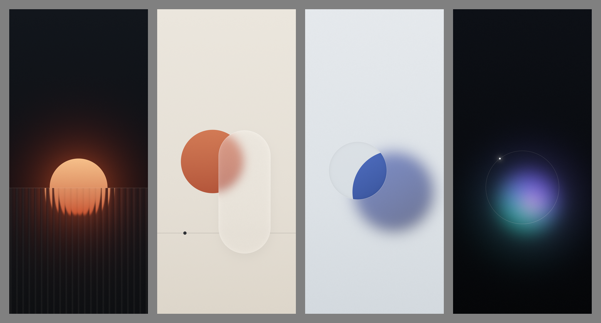

# wallpapa

Minimal phone wallpapers, 1440×3168. Rendered procedurally with numpy (linear light, dithered output).

| | |
|---|---|
| `01-fluted` | amber sun half-sunk behind reeded glass |
| `02-frost` | terracotta disc behind a frosted glass capsule |
| `03-clear` | frosted pane over a cobalt disc, one round window wiped clean |
| `04-aura` | defocused cool glow inside a hairline ring |

Re-render: `pip install numpy pillow && cd src && python3 w1_fluted.py` (etc.).
