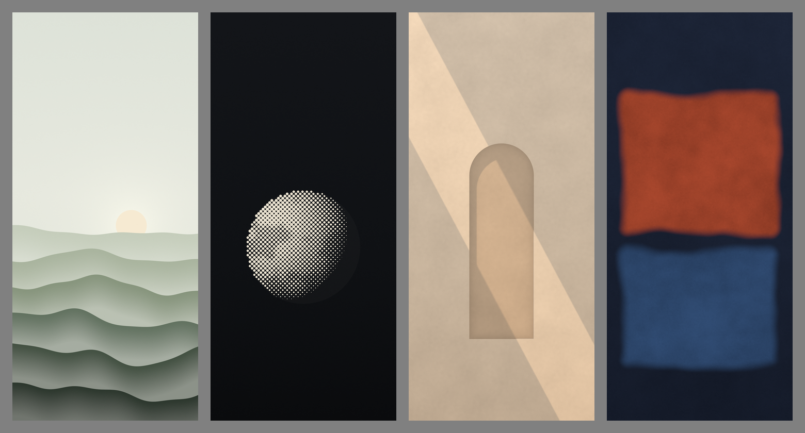
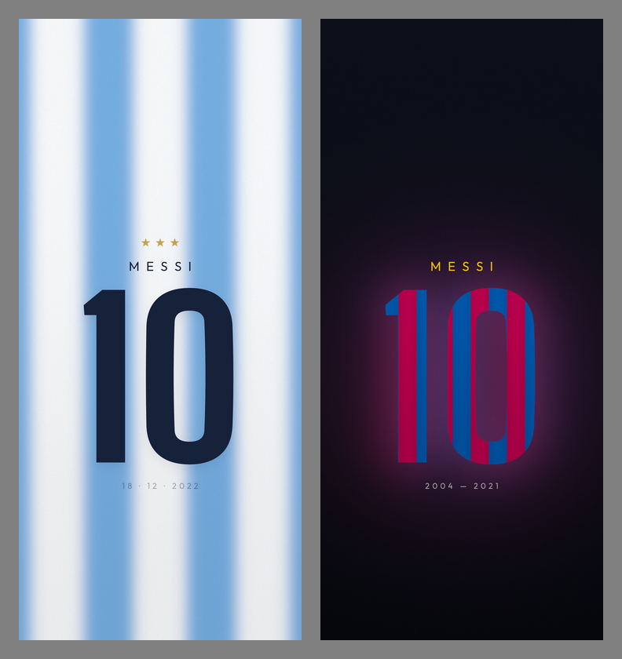
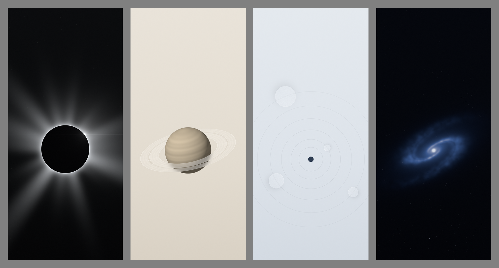
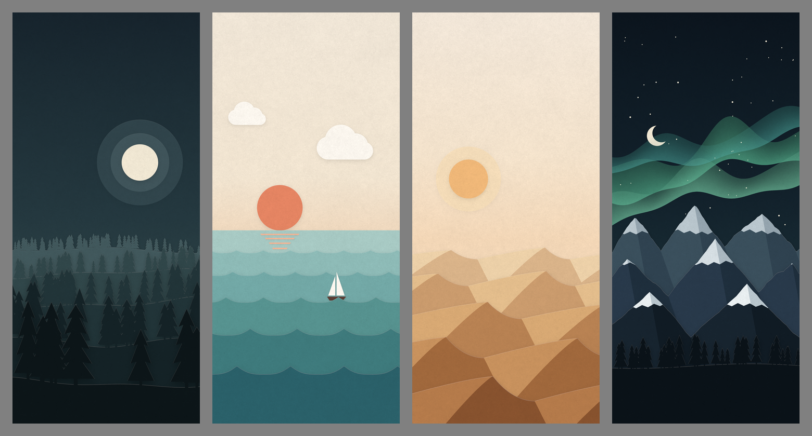

# wallpapa

Minimal phone wallpapers, 1440×3168. Rendered procedurally with numpy (linear light, dithered output).

| | |
|---|---|
| `01-fluted` | amber sun half-sunk behind reeded glass |
| `02-frost` | terracotta disc behind a frosted glass capsule |
| `03-clear` | frosted pane over a cobalt disc, one round window wiped clean |
| `04-aura` | defocused cool glow inside a hairline ring |
| `05-ridges` | layered sage hills with mist in the valleys |
| `06-halftone` | a moon printed as a rotated dot screen |
| `07-niche` | arched recess in a plaster wall, a band of late sun |
| `08-field` | two soft colour fields, after Rothko's rust and blue |
| `09-albiceleste` | Messi's 10 as frosted glass over Argentina stripes, three stars |
| `10-blaugrana` | Messi's 10 cut from Barça stripes, glowing on night blue |
| `11-eclipse` | black moon, soft streaming corona, one diamond bead |
| `12-saturn` | sand-toned planet wearing rings of frosted glass |
| `13-orbits` | hairline orbits from above, planets as frosted glass discs |
| `14-galaxy` | a tilted spiral made only of blur, over crisp stars |
| `15-pines` | paper-cut forest at night, tiers of firs and a haloed moon |
| `16-sea` | paper-cut swells under a coral sun, clouds and a sailboat |
| `17-dunes` | paper-cut dunes, each with a lit face and a shaded lee |
| `18-aurora` | paper-cut snowy peaks under vellum ribbons of aurora |

Fonts in `fonts/` are Big Shoulders and Outfit (SIL Open Font License).

Re-render: `pip install numpy pillow && cd src && python3 w1_fluted.py` (etc.).
